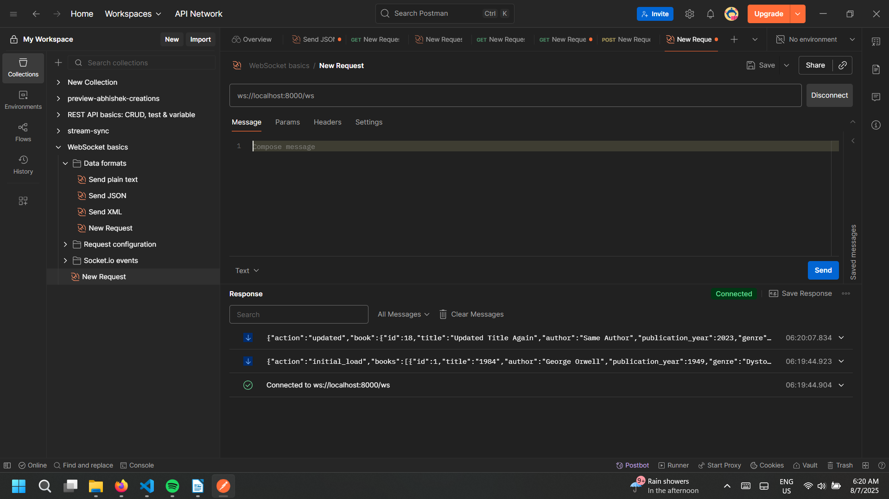
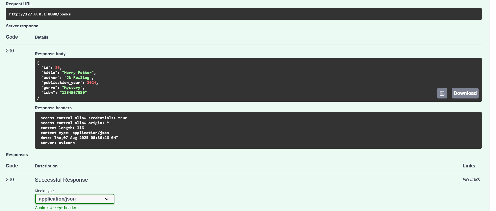
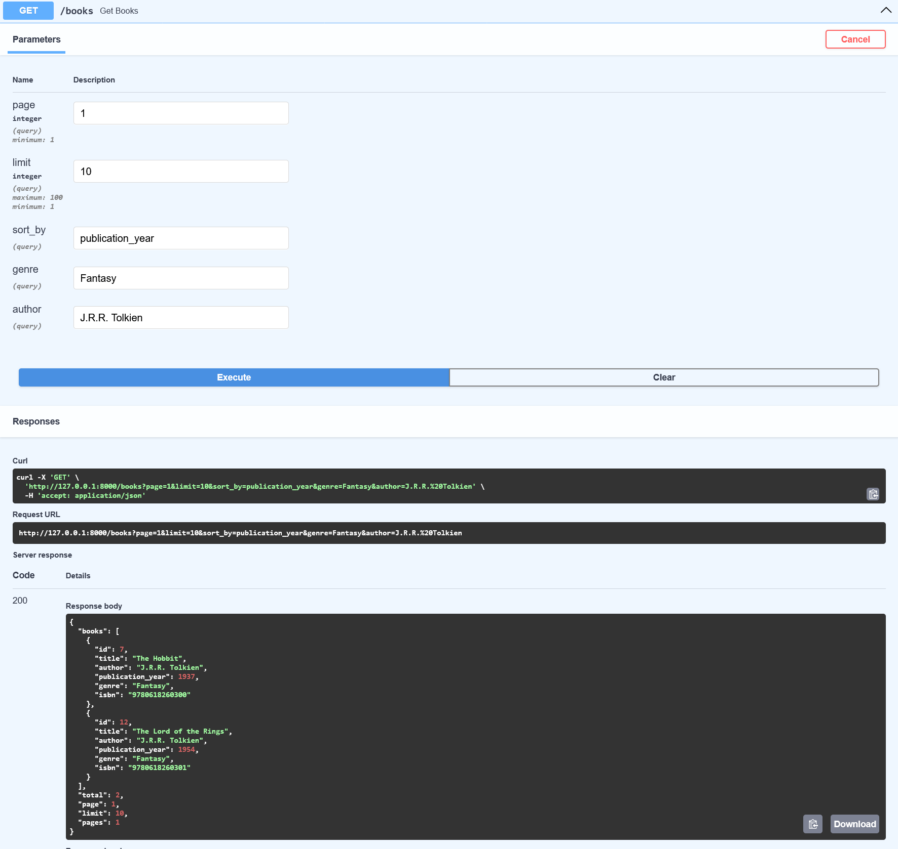
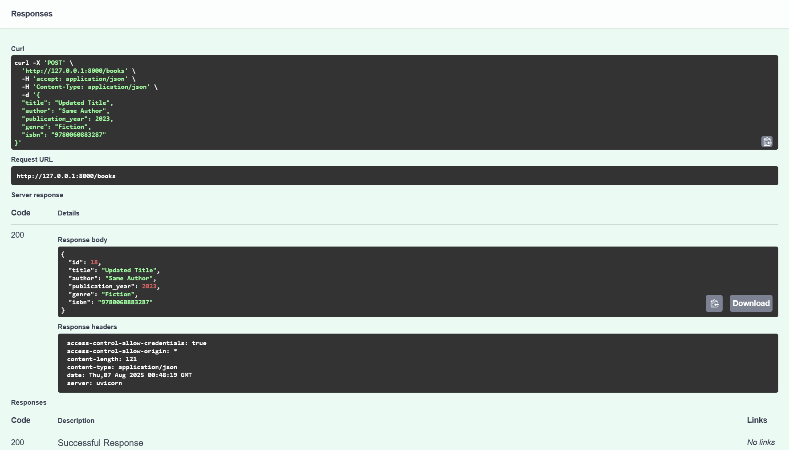
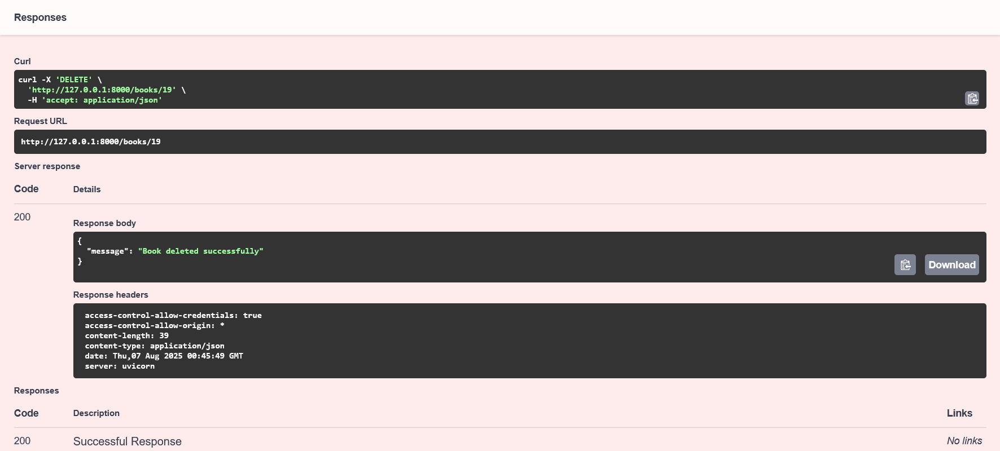

## Book Management API

A FastAPI application for managing books with real-time updates via WebSocket connections.

## Key Problems Solved

  -Race Conditions - Used asyncio locks to prevent concurrent file operations from corrupting JSON data
  -Real-time Broadcasting - WebSocket connections maintain persistent duplex channels for instant client notifications

## API Screenshots

### WebSocket Connection


### Create Book


### Read Books


### Update Book  


### Delete Book



## Features

### Create/Update: Combined Operations ✅

**Update existing book by ISBN match:**
```bash
POST /books
{
  "title": "Updated Title",
  "author": "Same Author",
  "publication_year": 2023,
  "genre": "Fiction",
  "isbn": "9780743273565"
}
```
**Response:**
```json
{
  "id": 1,
  "title": "Updated Title",
  "author": "Same Author", 
  "publication_year": 2023,
  "genre": "Fiction",
  "isbn": "9780743273565"
}
```

**Update existing book by title+author+year combination:**
```bash
POST /books
{
  "title": "The Great Gatsby",
  "author": "F. Scott Fitzgerald",
  "publication_year": 1925,
  "genre": "Classic",
  "isbn": "9999999999"
}
```
**Response:**
```json
{
  "id": 1,
  "title": "The Great Gatsby",
  "author": "F. Scott Fitzgerald",
  "publication_year": 1925,
  "genre": "Classic", 
  "isbn": "9999999999"
}
```

### Create New Book ✅

**Create new book with auto-generated ID:**
```bash
POST /books
{
  "title": "New Book",
  "author": "New Author",
  "publication_year": 2024,
  "genre": "Mystery",
  "isbn": "1234567890"
}
```
**Response:**
```json
{
  "id": 3,
  "title": "New Book",
  "author": "New Author",
  "publication_year": 2024,
  "genre": "Mystery",
  "isbn": "1234567890"
}
```

### ISBN Uniqueness Validation ✅

**Duplicate ISBN rejection:**
```bash
POST /books
{
  "title": "Another Book",
  "author": "Another Author", 
  "publication_year": 2024,
  "genre": "Fiction",
  "isbn": "9780743273565"
}
```
**Response:**
```json
{
  "detail": "ISBN already exists"
}
```

### Publication Year Validation ✅

**Invalid year rejection:**
```bash
POST /books
{
  "title": "Future Book",
  "author": "Time Traveler",
  "publication_year": 2030,
  "genre": "Sci-Fi", 
  "isbn": "1111111111"
}
```
**Response:**
```json
{
  "detail": "ensure this value is less than or equal to 2025"
}
```

### Pagination Support ✅

**Paginated book retrieval:**
```bash
GET /books?page=1&limit=5
```
**Response:**
```json
{
  "books": [...],
  "total": 10,
  "page": 1,
  "limit": 5,
  "pages": 2
}
```

### Sorting Support ✅

**Sort by title, author, or publication year:**
```bash
GET /books?sort_by=publication_year
```
**Response:**
```json
{
  "books": [
    {"id": 1, "title": "Old Book", "publication_year": 1925, ...},
    {"id": 2, "title": "New Book", "publication_year": 2024, ...}
  ],
  "total": 2,
  "page": 1,
  "limit": 10,
  "pages": 1
}
```

### Filtering Support ✅

**Filter by genre or author:**
```bash
GET /books?genre=Fiction&author=Harper Lee
```
**Response:**
```json
{
  "books": [
    {
      "id": 2,
      "title": "To Kill a Mockingbird", 
      "author": "Harper Lee",
      "genre": "Fiction",
      ...
    }
  ],
  "total": 1,
  "page": 1,
  "limit": 10,
  "pages": 1
}
```

### Real-time WebSocket Updates ✅

**WebSocket connection for live updates:**
```javascript
const ws = new WebSocket('ws://localhost:8000/ws');
ws.onmessage = (event) => {
    const data = JSON.parse(event.data);
    console.log(data);
};
```
**Response on book update:**
```json
{
  "action": "updated",
  "book": {
    "id": 1,
    "title": "Updated Book",
    "author": "Author Name",
    ...
  }
}
```

**Response on book creation:**
```json
{
  "action": "created", 
  "book": {
    "id": 3,
    "title": "New Book",
    ...
  }
}
```

### Delete Operations ✅

**Delete book by ID:**
```bash
DELETE /books/1
```
**Response:**
```json
{
  "message": "Book deleted successfully"
}
```

## Technical Implementation

### JSON File Storage ✅
- All data persisted in `books.json`

### Thread Safety ✅
- Async locks for concurrent file operations
- WebSocket connection management with locks

### Realtime Updates ✅
- WebSocket connection for live updates

### Error Handling & Validation ✅
- Pydantic models for request validation
- HTTP status codes for different scenarios
- Graceful error responses

### Meaningful Responses ✅
- Consistent JSON response format
- Clear error messages
- Detailed pagination metadata

## Setup & Installation

```bash
pip install -r requirements.txt

uvicorn main:app --reload

# Access API documentation
# http://localhost:8000/docs
```

API Endpoints
GET /books - gets all books, has page and limit stuff
POST /books - adds new book or updates existing one
DELETE /books/{id} - removes book with that id
WS /ws - websocket for live updates
